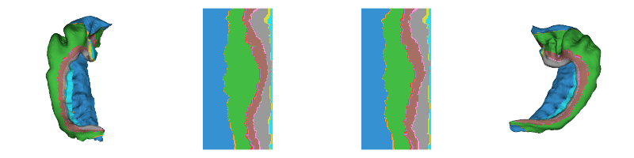
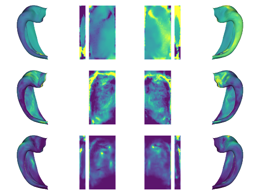

## Useful Matlab & Python tools for plotting and manipulating outputs from [HippUnfold](https://github.com/khanlab/hippunfold).

In-depth tools are offered in Python, but there are also useful Matlab examples and functions.

***NEW*** This toolbox now uses [BrainSpace](https://github.com/MICA-MNI/BrainSpace)'s plotting tools, which are built in VTK libraries. The old version (matplotlib) can be found [here](https://github.com/jordandekraker/hippunfold_toolbox/tree/matplotlib).

### Example (Individual subject):
```
plotting.surfplot_sub_foldunfold('hippunfold_output_directory/hippunfold', sub='bbhist', ses='',
                        features=['subfields'], labels=['hipp'], modality='corobl', cmap='tab10')
```


This function is perfect for plotting HippUnfold results from one individual subject. Here we are plotting subfields, but other features that are automatically generated by HippUnfold, such as thickness, gyrification, curvature, or any added data following the same naming convention can also be plotted.

### Example (Averaging subjects):
```
all_data = np.load('mydata.pkl')
# this is an array with the shape Vx2xSxF, where V is the number of vertices, 2 is the
# number of hemispheres, S is the number of subjects, and F is a stack of different features.

averaged_data = np.mean(all_data,axis=2)
plotting.surfplot_canonical_foldunfold(averaged_data, tighten_cwindow=True)
```


This function uses a "canonical" rather than subject-specific surface, and plots a colour overlay that I have already loaded or generated in my Python environment. In this example, I loaded the curvature, thickness, and gyrification data from a set of 50 subjects in the [MICs dataset](https://osf.io/j532r/), then averaged across subjects. 

### Example (Matlab):
```
plot_subject_foldunfold('My_hippunfold_Output_directory/hippunfold', '001', 'subfields');
```


### Tutorials
The `Notebooks/` directory contains many useful examples of how to load gifti and nifti data as output by HippUnfold (or other software), and combine it with additional data including, for example, mapping of a rsfMRI timeseries:


## Installation

Python:

```
git clone https://github.com/jordandekraker/hippunfold_toolbox.git
pip install hippunfold_toolbox/
```

Matlab:

```
git clone https://github.com/jordandekraker/hippunfold_toolbox.git
addpath(genpath('hippunfold_toolbox/Matlab'))
```


